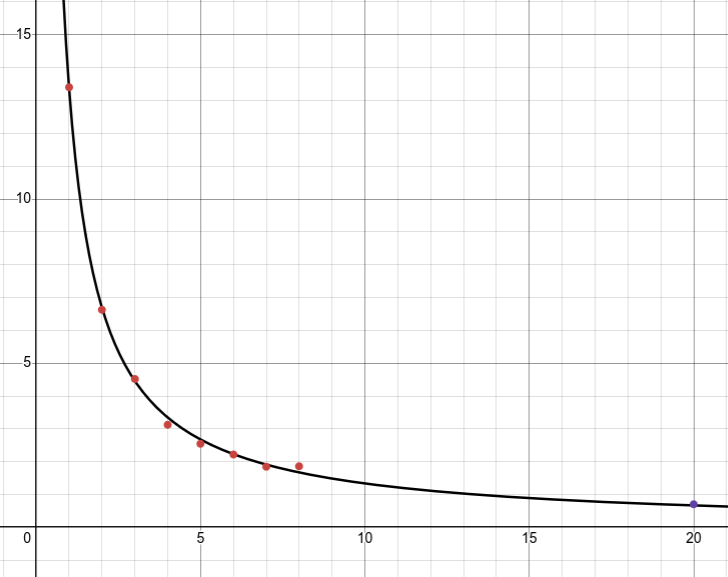

## Поиск составных чисел
### Анализ производительности

*X – число используемых потоков, Y – время выполнения в секундах*

Точка справа – результат применения реализации с parallel streams 
(предполагается, что она создает 20 потоков, по одному на каждое 
ядро процессора)

Черная кривая – предполагаемое время выполнения в предположении,
что применение n потоков ускоряет программу в n раз, и что доля
кода программы, выигрывающая от параллельного исполнения равна 1.

То есть программа исполняется параллельно около 100% времени.

### Тестовые данные
Выбран большой массив (более 100 элементов), все числа больше
миллиона. Это сделано для того, чтобы минимизировать влияние
среды на результаты бенчмарка.

Все числа простые, кроме предпоследнего, чтобы зависимость
времени исполнения от степени параллелизма была наглядной, и
не возникало таких ситуаций, когда один из потоков по совпадению 
сразу находит составное число.